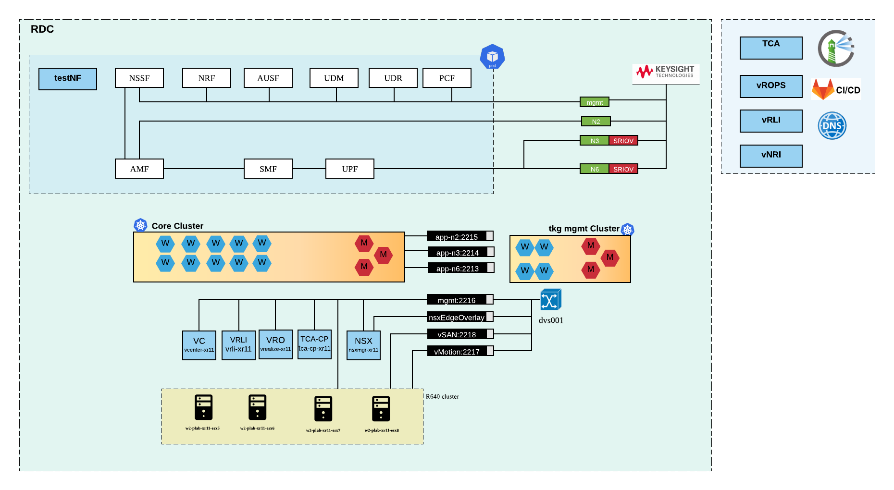
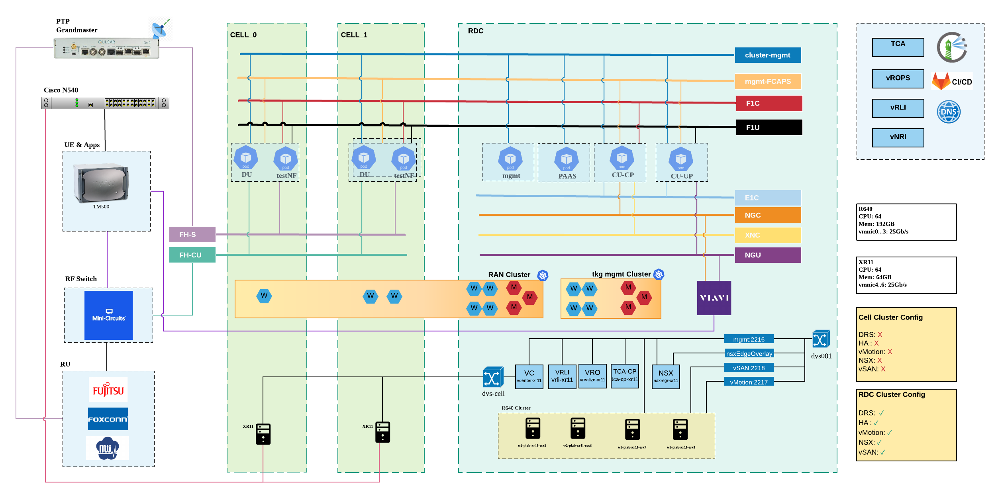
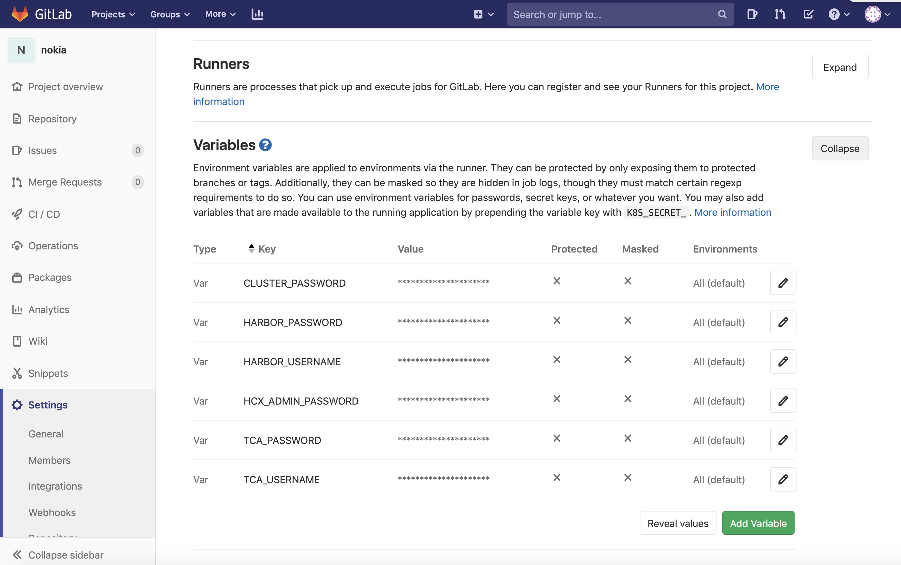
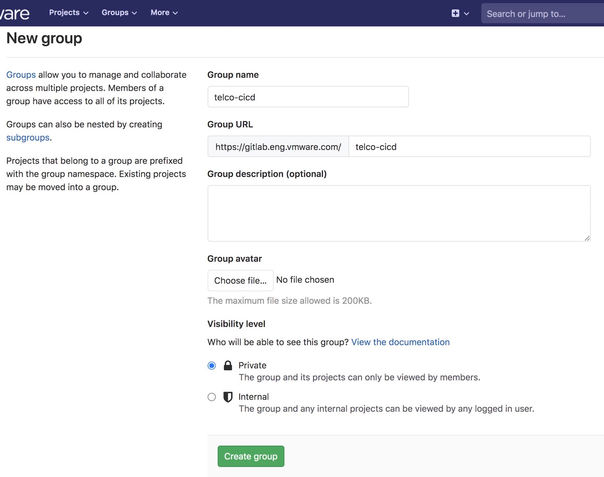
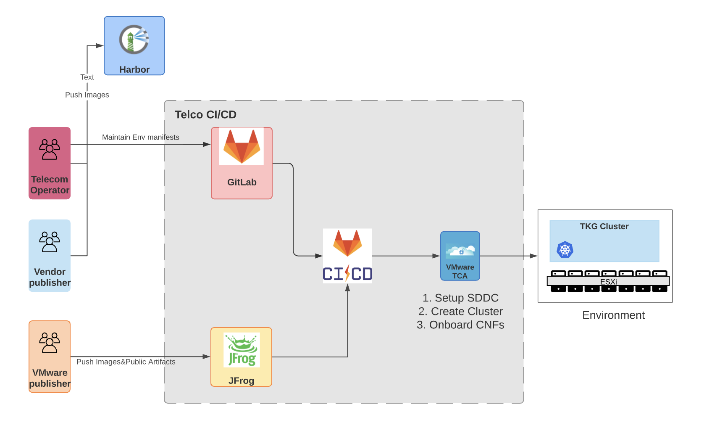
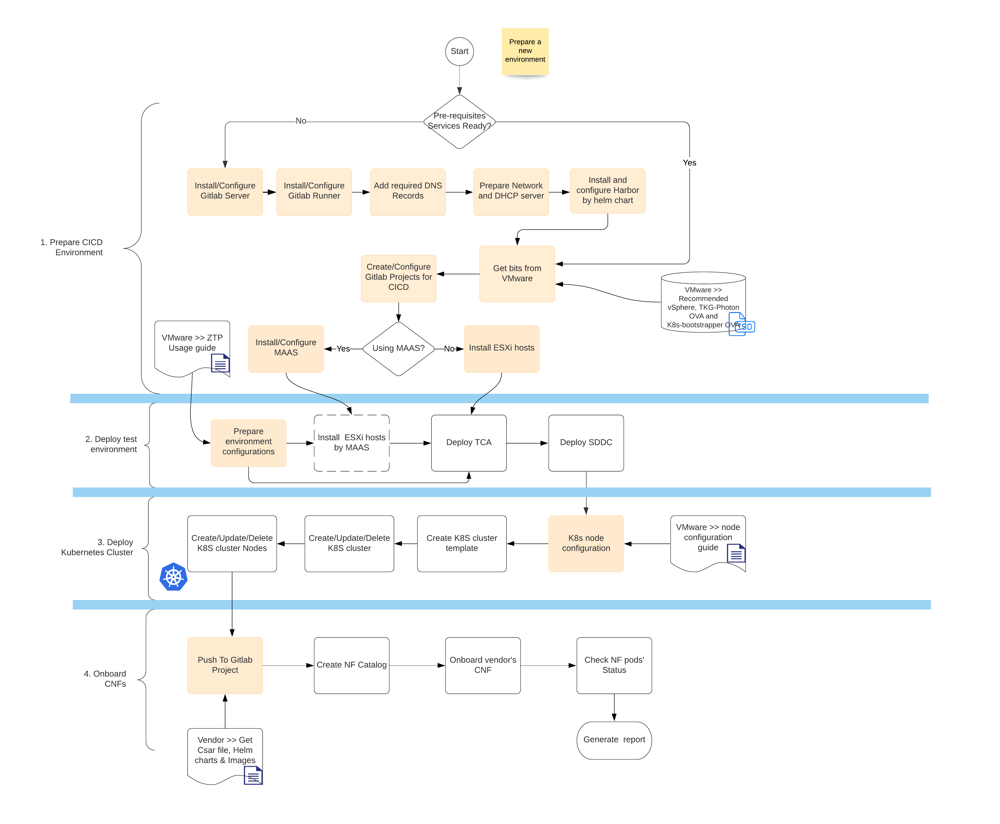
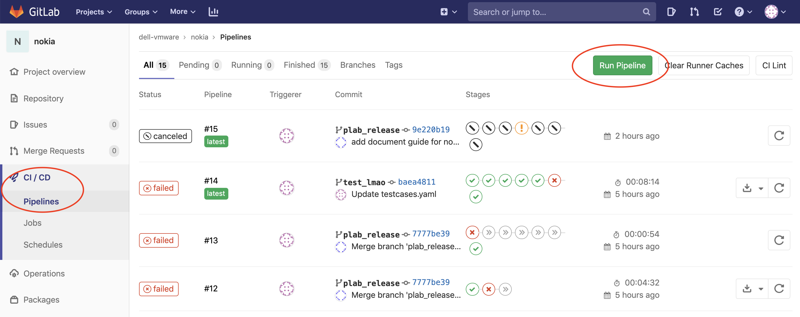
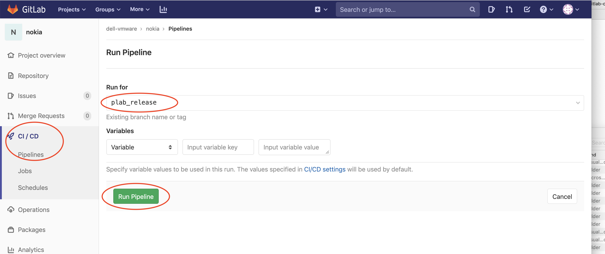
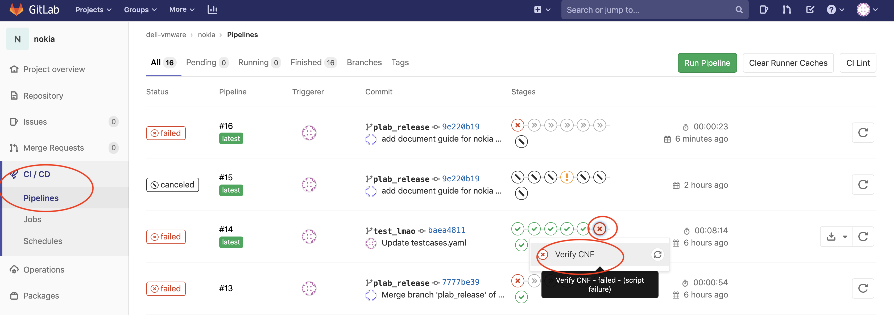
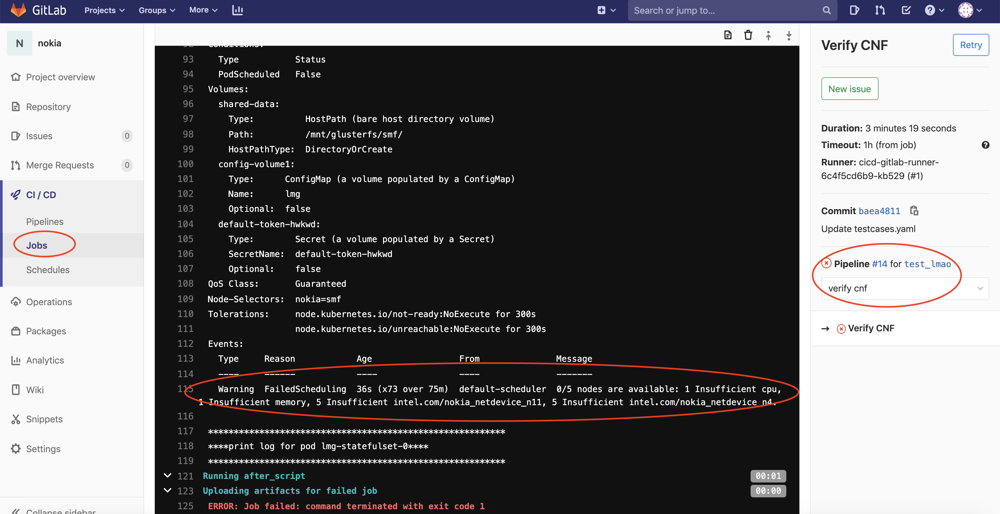

Welcome to Continuous Integration/Continuous Delivery (CI/CD) documentation.

This documentation will show a step-by-step process on how to deploy and use the Telco Cloud Automation (TCA) CI/CD pipelines.

## Table of Contents
- [Table of Contents](#table-of-contents)
- [5G Core and RAN test Topology](#5g-core-and-ran-test-topology)
- [Pre-requisites](#pre-requisites)
  - [GitLab Server](#gitlab-server)
    - [Setup GitLab](#setup-gitlab)
    - [Create GitLab Group](#create-gitlab-group)
    - [Setup GitLab Runner](#setup-gitlab-runner)
  - [Harbor Server](#harbor-server)
- [Telco CI/CD Introduction](#telco-cicd-introduction)
  - [Components](#components)
  - [Workflow](#workflow)
  - [Usage](#usage)
    - [How to trigger pipeline](#how-to-trigger-pipeline)
    - [How to modify pipeline rules to control when and whether to trigger the pipeline](#how-to-modify-pipeline-rules-to-control-when-and-whether-to-trigger-the-pipeline)
    - [How to apply to your own Gitlab](#how-to-apply-to-your-own-gitlab)
    - [How to view details/logs of a stage](#how-to-view-detailslogs-of-a-stage)
    - [Slack Integration](#slack-integration)
  - [Pipeline Introduction](#pipeline-introduction)
    - [SDDC Pipeline](#sddc-pipeline)
    - [Cluster Pipeline](#cluster-pipeline)
    - [CNF Pipeline](#cnf-pipeline)
- [Test Suites](#test-suites)
  - [Testsuites Introduction](#testsuites-introduction)
  - [Security Testing](#security-testing)
  - [Conformance Testing](#conformance-testing)
  - [Performance Testing](#performance-testing)
  - [Platform Testing](#platform-testing)

## 5G Core and RAN test Topology
VMWare TCA Platform automates infrastructure and CNF/VNF management for customers to deploy and manage 5G environments. TCA supports both 5G Core and RAN environments.
CI/CD pipelines leverage TCA support to create sample 5G Core/RAN labs and executes tests to validate the stack and run 5G specific tests.

- Example Core lab topology

For this test lab, CI/CD creates an SDDC and TCA stack which will build Kubernetes clusters to run Core CNFs. After the infrastructure is created, CNF onboarding pipeline is executed to deploy Core CNFs.
Keysight, or other type of 5G testing simulation tool can be leveraged in the lab for advanced end to end testing.

- Example RAN lab topology

For this lab, CI/CD creates an SDDC and TCA stack and builds RAN Kubernetes cluster to host 5G RAN CNFs. After the Kuberentes cluster is ready, CNF onboarding pipelines are exectured to deploy RAN CNFs.
For RAN testing, TCA testNF can be leveraged to run cyclictest and Flexran tests.
For full end to end testing, more hardware and tools such as ptp/RU/UE-simulators are required. These are not deployed/managed by CI/CD.

## Pre-requisites

### GitLab Server

From project planning and source code management to CI/CD and monitoring, GitLab is a complete DevOps platform, delivered as a single application.

#### Setup GitLab

- GitLab 12.5 or higher.
- GitLab Runner is routable to TCA platform.
- Variables are required for the pipeline.

  Different projects require different variables. Please see details in each project's README.md and make sure the variables are provided correctly.

  

- A GitLab server is required to hold all configurations repositories and related pipelines.
- Pipelines have been tested on GitLab versions `12.10.+-ee`.
- Both public and self-managed GitLab is supported.
  - For public [GitLab](https://www.gitlab.com) (or GitLab on public cloud), the runner must be able to connect from your Intranet to the public GitLab.

  - For self-managed GitLab installation, please refer to GitLab [guides](https://about.gitlab.com/install/).

#### Create GitLab Group

Once the GitLab is deployed, login and create a Gitlab group.

Steps:

1. Go to Groups --> Explore Groups. Click the 'New Group' button.

2. Input group name and modify the Visibility level if you want.

3. Click 'Create Group' to create the group.

#### Setup GitLab Runner

In GitLab CI/CD, runners run the code defined in `.gitlab-ci.yml`. A runner is a _"lightweight, highly-scalable agent that picks up a CI job through the coordinator API of GitLab CI/CD, runs the job, and sends the result back to the GitLab instance."_

There're several types of runners. A [Group runner](https://docs.gitlab.com/ee/ci/runners/#group-runners) is suitable for our CI/CD projects.

Please refer to the [Install GitLab Runner](https://docs.gitlab.com/runner/install/index.html) Guide to install and register runners.

We suggest you to install them in `docker` or `kubernetes` way.

> If you install Gitlab Runner as Linux service or as a Docker container, please remember to set Executor type to be `Docker`.
> 
> If you use private DNS server address, please make sure runner can resolve these FQDNs.

### Harbor Server

Harbor is an open source registry that secures artifacts with policies and role-based access control, ensures images are scanned and free from vulnerabilities, and signs images as trusted. It is used to provide OCI-compliant images and helm charts from vendors for GitLab pipeline. TLS-enabled harbor is recommended.

## Telco CI/CD Introduction

### Components
Telco CI/CD system consist of the following components:

- Pipelines in following GitLab projects:
  - `SDDC project` This project is responsible for the whole SDDC setup. It contains all the host, network, and other information about your environment.
  - `K8S cluster project` This project is responsible for cluster template and cluster creation, update and other functions.
  - `CNFs projects` We suggest to separate different CNF from different vendors into different projects. These projects will manage CNFs.
  
- Docker images
  - `cicd-toolbox` Docker image which contains the tooling required by the pipelines during runtime.
     - `tcactl` CLI tool to interact with TCA. Used in CNFs and K8S cluster projects.
     - `tcpctl` CLI tool to interact with TCP. Used in SDDC project.
  - `cicd-testsuites` Docker image which contains all test cases run against a TCA cluster.

### Workflow

We will publish all the project manifests and docker images on Jfrog.

Telecom operators can get the manifests and apply changes on their GitLab, then modify all the configurations in their own environment. Instructions on how to modify these configurations in these projects see each project's README.md.

Assuming you start with a fresh environment, you should do the following steps.

### Usage
#### How to trigger pipeline

There are two ways to trigger the pipeline:

1. **Manually using `Run Pipeline` button**:

    Location:  `GitLab project -> CI/CD -> Pipelines`.
    *Make sure to select correct branch, if different from default branch.*

    
    

2. **Auto trigger with code commit**

    Use Gitlan pipeline rules to control whether and when to trigger the pipeline automatically. 
    
    Different pipeline may have different rules. You can refer `.gitlab/ci/rules.gitlab-ci.yml` in each project.

#### How to modify pipeline rules to control when and whether to trigger the pipeline
In each project, there is a file `.gitlab/ci/rules.gitlab-ci.yml`. All the pipeline rules are set here.

For more Gitlab rules details, see [Gitlab CICD Reference](https://docs.gitlab.com/ee/ci/yaml/#rules)

#### How to apply to your own Gitlab

You can follow the steps to apply artifacts(Gitlab project files) into your own GitLab.

Different project may have different structure. These are common steps: 
- Create an empty project in your own Gitlab.
- Get latest artifacts and copy them to the new project.
- Follow README.md in each artifacts to modify the configuration files to align with your own environment. 
- Commit & Push them to your own repository.

#### How to view details/logs of a stage

Go to project -> CI/CD -> Pipelines, click on the failed/passed stage:

GitLab will redirect to the details of the stage:

#### Slack Integration

Please refer to this [page](https://docs.gitlab.com/ce/user/project/integrations/slack.html).

### Pipeline Introduction
#### SDDC Pipeline
See the following document `Hardware Deployment CI/CD Document`

#### Cluster Pipeline
See the following document `K8S Cluster CI/CD Document`

#### CNF Pipeline
All CNF pipelines are similar. Take external DNS CNF onboarding as an example. See `CNF CI/CD Document`

## Test Suites

### Testsuites Introduction

All the test suites have been built into a Docker image: `telcovmware/cicd-testsuites`.

All tests parameters are in file `testcases.yaml`.

Push a new version of `testcases.yml` to update the parameters.

### Security Testing

[Kube-bench](https://github.com/aquasecurity/kube-bench) can be used to check whether Kubernetes is deployed securely by running the checks documented in the CIS Kubernetes Benchmark.

`kube-bench` is a Go application that checks whether Kubernetes is deployed securely by running the checks documented in the CIS Kubernetes Benchmark.

Tests are configured with YAML files, making this tool easy to update as test specifications evolve.

*__Note:__*

  1. kube-bench implements the CIS Kubernetes Benchmark as closely as possible. Please raise issues here if kube-bench is not correctly implementing the test as described in the Benchmark. To report issues in the Benchmark itself (for example, tests that you believe are inappropriate), please join the CIS community.

  1. There is not a one-to-one mapping between releases of Kubernetes and releases of the CIS benchmark. See CIS Kubernetes Benchmark support to see which releases of Kubernetes are covered by different releases of the benchmark.

  1. It is impossible to inspect the master nodes of managed clusters, e.g. GKE, EKS and AKS, using kube-bench as one does not have access to such nodes, although it is still possible to use kube-bench to check worker node configuration in these environments.

### Conformance Testing

[Sonobuoy](https://github.com/vmware-tanzu/sonobuoy/) is a diagnostic tool that makes it easier to understand the state of a Kubernetes cluster by running a set of Kubernetes conformance tests and other plugins in an accessible and non-destructive manner.

The Kubernetes end-to-end testing plugin (the e2e plugin) is used to run tests which are maintained by the upstream Kubernetes community in the kubernetes/kubernetes repo.

### Performance Testing

This [test suite](https://github.com/mrahbar/k8s-testsuite) consists of two Helm charts for network bandwidth testing and load testing a Kubernetes cluster.

### Platform Testing

Suite of real-time tests - `cyclictest`, `hwlatdetect`, `pip_stress`, `pi_stress`, `pmqtest`, `ptsematest`, `rt-migrate-test`, `sendme`, `signaltest`, `sigwaittest`, [`svsematest`](https://git.kernel.org/pub/scm/utils/rt-tests/rt-tests.git/).
# vmw
