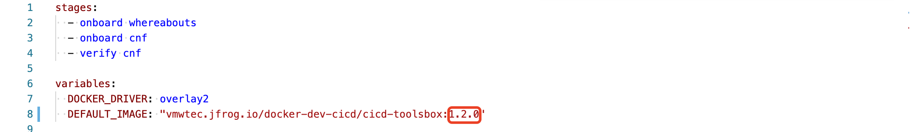

## Latest Release: 1.2.0
- Telco CI/CD 1.2.0 | 5 Sep 2021

## What's in the Release Notes
The release notes cover the following topics:
- [What's in the Release Notes](#whats-in-the-release-notes)
- [About Telco CI/CD](#about-telco-cicd)
- [New Features](#new-features)
- [Deliverables](#deliverables)
  - [1.2.0](#anchor-120)
  - [How to use new image](#how-to-use-new-image)
- [Supported TCA Versions](#supported-tca-versions)

## About Telco CI/CD
Telco CI/CD provides a noninteractive system to orchestrate 5G environment setup including underlying SDDC, Kubernetes and CNF via TCA.

## New Features ##
- Enable TCA SDK when making API call.
- Add delete operation of CNF and Kubernetes cluster.
- Support Airgap extension which is a new feature of TCA 1.9.5.
- Automated CSAR analysis​.
- TCP CAT enablement​.
- Support TestNF 1.4.
- Support TCA 1.9.5.
- Backward compatibility of TCA 1.9.0 and 1.9.1

## Deliverables ##

### 1.2.0
- CICD Image: vmwtec.jfrog.io/docker-production-cicd/cicd-toolsbox:1.2.0

### How to use new image
For each project, there is a file name as `.gitlab-ci.yml`. You can specific DEFAULT_IMAGE value with your target tag, e.g 1.2.0

## Supported TCA Versions ##
- TCA 1.9.5
- TCA 1.9.1
- TCA 1.9.0
