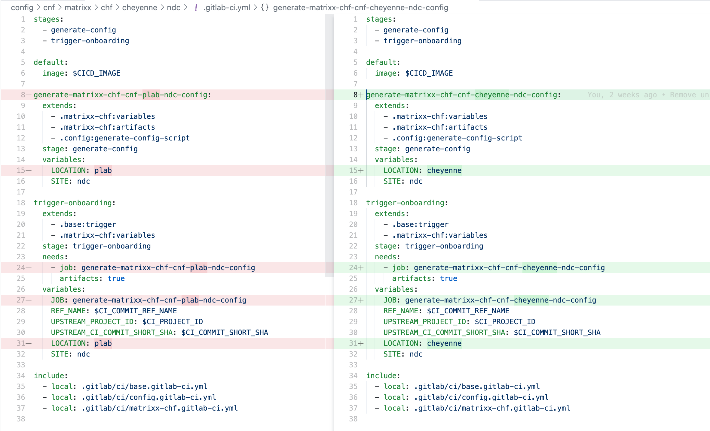
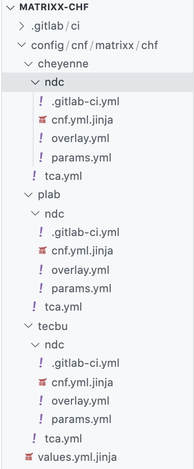
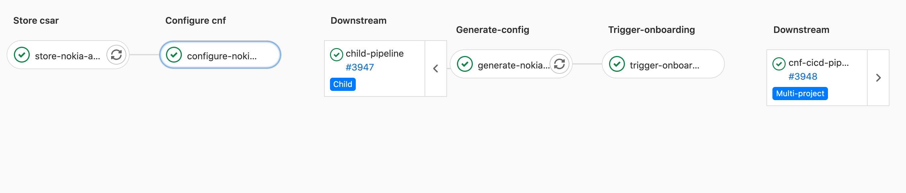
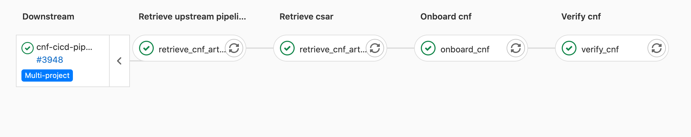

# This is the development guide for Telco CICD

Developers looking to get up to speed with the CICD pipelines can start here.

## Getting Started

The Telco CICD pipeline is a [multi-project](https://docs.gitlab.com/ee/ci/multi_project_pipelines.html) pipeline that spans multiple Gitlab repositories. Each CNF is in its own Gitlab project which contains the CSAR file and configuration for onboarding it, as well as a pipeline to generate the config by rendering templates based on its location and site. This is called the "cnf pipeline" in the docs. After generating the config, the `cnf` pipeline calls the pipeline in the downstream [cnf-cicd-pipeline](https://gitlab.eng.vmware.com/telco-cicd/cnf/cnf-cicd-pipeline) project which contains the pipeline that performs the actual onboarding and instantiation of a CNF.

### CNF Pipeline

The overall project structure for the `cnf` pipeline consists of one `.gitlab-ci.yml` file in the root of the project and separate `<CNF>.gitlab-ci.yml` and `<CNF>-triggers.gitlab-ci.yml` files in the `.gitlab/ci` folder that is included in every `CNF` that is pipelined.

The `cnf` pipeline is implemented as a [parent-child](https://docs.gitlab.com/ee/ci/parent_child_pipelines.html) pipeline where the parent calls down to the child pipelines located lower in the taxonomy (.e.g., `config/matrixx-chf/cheyenne/ndc/.gitlab-ci.yaml`).

The `cnf` pipeline kicks off the pipeline by calling two stages. The first stage is to store the `csar` and that stage only runs if you've set the `USE_ARTIFACTORY` variable to `true`. The other stage called is called `configure cnf`. The purpose of this stage is to trigger a separate child pipeline: one for every location and site combination. This stage of the pipeline only gets triggered if something changes to the configuration located in that CNF's config folder (further explained below). Or, you can manually kick off the pipeline, as long as you specify the `SITE` and `LOCATION` variables. For example, if you make a change to the `values.yml.jinja` template under `.../cheyenne/rdc` then it will trigger the `configure cnf` stage to run.

The root `.gitlab-ci.yml` file should look something like this:

```yaml
stages:
  - store csar
  - configure cnf

default:
  image: $CICD_IMAGE
...
include:
  - local: .gitlab/ci/matrixx-chf.gitlab-ci.yml
  - local: .gitlab/ci/config.gitlab-ci.yml
  - local: .gitlab/ci/matrixx-triggers.gitlab-ci.yml
```

To create a new parent pipeline for a CNF, you only need to copy an existing `<CNF>.gitlab-ci.yml` and `<CNF>-triggers.gitlab-ci.yml` file in the `gitlab/ci/` folder where `<CNF>` is replaced with the name of the CNF for which you want to pipeline.

For example, the parent pipeline file for `matrixx-chf` looks like this:

```yaml
# ----------------------------------------------------------------------------------------------------
# Manually or externally triggered pipeline
# ----------------------------------------------------------------------------------------------------

configure-matrixx-chf-tecbu-ndc-when-manual:
  stage: configure cnf
  trigger:
    include: config/cnf/matrixx/chf/tecbu/ndc/.gitlab-ci.yml
    strategy: depend
  rules:
    - if: '($CI_PIPELINE_SOURCE == "web" || $CI_PIPELINE_SOURCE == "trigger") && ($LOCATION =~ /tecbu/ && $SITE =~ /ndc/)'

configure-matrixx-chf-cheyenne-ndc-when-manual:
  stage: configure cnf
  trigger:
    include: config/cnf/matrixx/chf/cheyenne/ndc/.gitlab-ci.yml
    strategy: depend
  rules:
    - if: '($CI_PIPELINE_SOURCE == "web" || $CI_PIPELINE_SOURCE == "trigger") && ($LOCATION =~ /cheyenne/ && $SITE =~ /ndc/)'

# ----------------------------------------------------------------------------------------------------
# Triggered only by config changes
# ----------------------------------------------------------------------------------------------------

configure-matrixx-chf-tecbu-ndc-when-config-change:
  stage: configure cnf
  trigger:
    include: config/cnf/matrixx/chf/tecbu/ndc/.gitlab-ci.yml
    strategy: depend
  rules:
    - if: '$CI_PIPELINE_SOURCE == "web" || $CI_PIPELINE_SOURCE == "trigger"'
      when: never
    - changes:
      - "config/cnf/matrixx/chf/tecbu/ndc/**"

configure-matrixx-chf-cheyenne-ndc-when-config-change:
  stage: configure cnf
  trigger:
    include: config/cnf/matrixx/chf/cheyenne/ndc/.gitlab-ci.yml
    strategy: depend
  rules:
    - if: '$CI_PIPELINE_SOURCE == "web" || $CI_PIPELINE_SOURCE == "trigger"'
      when: never
    - changes:
      - "config/cnf/matrixx/chf/cheyenne/ndc/**"
```

The rules are there for triggering the pipeline manually and whenever a config change occurs. Only one of those jobs should run.

As you can see, there isn't much in this file except for trigger jobs that call a separate child pipeline for each environment (location/site) the CNF can be installed. In the above example, the `matrixx-chf` is installed in the `tecbu` lab and in `cheyenne`. And more specifically, the `NDC` site. The `rules` section indicates that the child pipeline is triggered only when changes occur to its specific configuration files or exclusively when the pipeline is triggered manually or by an external trigger.

Using the example above, the next file to look at is the child pipeline located under `config/<CNF>/<LOCATION>/<SITE>` where **CNF** would be `matrixx-chf`, **LOCATION** could be `cheyenne` or `tecbu` and **SITE** would be `ndc`. Let's examine both of the pipelines next to each other.



As you can see, the only thing that varies between the two pipeline files is the location where the CNF will be onboarded. The commonality has been placed into [includes](https://docs.gitlab.com/ee/ci/yaml/includes.html) located in the base `.gitlab/ci` directory according to best practices. If you look at `base.gitlab-ci.yml` and `config.gitlab-ci.yml` you'll see things that are common across all CNF child pipelines.

Two stages are called in every child pipeline

```yaml
stages:
  - generate-config
  - trigger-onboarding
```

The job that executes the `generate-config` stage inherits the script located under `config.gitlab-ci.yml` and overrides site specific variables. The job will generate all configuration files required by the downstream `cnf-cicd-pipeline`. After which, the `trigger-onboarding` [bridge](https://docs.gitlab.com/ee/ci/multi_project_pipelines.html#triggering-a-downstream-pipeline-using-a-bridge-job) job will be called to invoke the downstream pipeline.

### Site Generated Configuration

Configuration for the `cnf` pipeline is structured according to a geographic taxonomy to represent _where_ (TCA site) the config changes will get applied. The config files in the project are templated using the [jinja](https://jinja.palletsprojects.com/en/2.11.x/) templating language and rendered with optional overlays to generate the configuration.

As previously mentioned, changes to the config values anywhere within the taxonomy will trigger the downstream pipeline from the `trigger-onboarding` stage. Using the matrixx-chf `cnf` pipeline as an example, if you make a change to the `matrixx-chf` `cnf.yml` file, that will trigger the [cnf-cicd-pipeline]((https://gitlab.eng.vmware.com/telco-cicd/cnf/cnf-cicd-pipeline)) to onboard the `matrixx-chf` CNF by using the rendered configuration produced by the `generate-config` stage.

The taxonomy tree for the [matrixx-chf](https://gitlab.eng.vmware.com/telco-cicd/cnf/cnf-config/tree/master/config/matrixx-chf) CNF looks like this:



The first stage of the pipeline requires building the config files that are necessary for a given CNF deployment. This includes the base `config.yml` and the overlaid configurations supplied from the `config` folder. The values are looked up by using the location and site variables to determine where the CNF is installed.  The `config` folder also provides the necessary value overrides and yaml overlays so the downstream `cnf-cicd-pipeline` can apply the appropriate config values to the CSAR. This especially applies to the `values.yml` files that are delivered from a vendor.

When a vendor gives us a CSAR, they also supply 1 or more Helm Chart value file(s) that get uploaded as part of the CSAR onboarding stage. Because those values contain a lot of environment specific values, they always require some changes. Changing the values and redeploying to every site would be error-prone and difficult to keep track of. Therefore, we keep these files under a folder structure that reflects the geographic locations where the CNFs are installed to make it easier to trigger deployments to the right environment when their values change. It also means we can upgrade one environment at a time and managing them in git gives us an audit trail of what changes were made and when.




### Required Variables

Every CNF has some required variables necessary for the pipeline to run. Currently, there are 5 main variables that determine which CNF is deployed.

```yaml
.matrixx-chf:variables:
  variables:
    CNF_DIR: NF/chf
    CNF_NAME: Matrix-CHF
    CNF_VERSION: 5201
    NAMESPACE: matrixx
    ONBOARD: "true"
    PRODUCT: chf
    VENDOR: matrixx
```

- **CNF_DIR**: The location of the CNF file that will be onboarded. This will be either downloaded from an artifact repository or cloned from a git repo.
- **CNF_NAME**: The name of the CNF that will be onboarded. This name should match the name of the git repository.
- **CNF_VERSION**: The version of the CNF that will be onboarded.
- **NAMESPACE**: Every CNF is deployed to a Kubernetes namespace
- **ONBOARD**: A true/false value to determine if onboard or just upload of the catalog should occur.
- **VENDOR**: The name of the vendor of the CNF that will be onboarded.
- **PRODUCT**: The product from the vendor of the CNF that will be onboarded.

### CNF CICD Pipeline

The [CNF CICD pipeline](https://gitlab.eng.vmware.com/telco-cicd/cnf/cnf-cicd-pipeline) runs the *onboarding*, *instantiation* and *verify* stages to fully install a CNF using [TCA](https://docs.vmware.com/en/VMware-Telco-Cloud-Automation/index.html) (Telco Cloud Automation). It's completely generic in that there isn't any code to couple it to installing any specific CNF. All the variability has been moved into the [upstream pipeline](https://gitlab.eng.vmware.com/telco-cicd/cnf/cnf-config) which calls it.

 

> Take note of that the pipeline was triggered from the cnf-config upstream pipeline.

The CNF CICD pipeline is not designed to be triggered manually. If you need to run it manually then you must know the location where you want it to get the configuration. It's designed to be triggered by the [CNF config](https://gitlab.eng.vmware.com/telco-cicd/cnf/cnf-config) pipeline. When the pipeline begins, it retrieves the configuration and CSAR artifacts from a URL-based location determined by the upstream pipeline that called it. It knows exactly which artifacts to retrieve based on the `JOB` variable that is passed to it. The `JOB` variable refers to the job in the upstream pipeline that created the configuration. Using that information, it can download the configuration and CSAR artifacts it needs. Once it has those things, it will run the `onboard` stage which uses the config and CSAR to start the *onboarding* and *instantiation* process required to completely install the CNF.

### Downstream Pipeline

The project structure for the CNF CICD pipeline consists of a `.gitlab-ci.yml` file in the root of the CNF pipeline which contains the main entry point to the pipeline and a list of stages that will be run when the pipeline is triggered.

```yaml
stages:
  - retrieve artifacts
  - onboard cnf
  - verify cnf
  - notify
```

The job that runs in the `retrieve artifacts` stage will download the configuration built from the upstream job. It extracts out the CSAR file and the generated `config.yml` and `generated-helm-values.yml` files required to run the `onboard cnf` stage.

The last section contains a list of includes that contain the actual stages that the pipeline goes through to deploy a CNF.

```yaml
include:
  - local: .gitlab/ci/config.gitlab-ci.yml
  - local: .gitlab/ci/global.gitlab-ci.yml
  - local: .gitlab/ci/rules.gitlab-ci.yml
  - local: .gitlab/ci/cnf.gitlab-ci.yml
  - local: .gitlab/ci/reports.gitlab-ci.yml
```

### CNF CICD Pipeline (Deploying Matrixx CHF)

To see a working example of the pipeline take a look at the following repositories in Gitlab.

- [CNF repo](https://gitlab.eng.vmware.com/telco-cicd/cnf/matrixx/matrixx-chf): only contains the CSAR and Helm Chart values supplied by the vendor unmodified. Inside the `config` folder is where all the configuration and templates used to configure the CNF are stored which also determine the location and site where TCA should install it.
- [CNF CICD pipeline repo](https://gitlab.eng.vmware.com/telco-cicd/cnf/cnf-cicd-pipeline): used to onboard any CNF or create k8s clusters. This is a downstream project in a multi-project pipeline. All communication to the TCA API is made from this pipeline.

## Upgrading a CNF

- Make sure the version number is added to the CSAR before committing (e.g., `Matrixx-CHF-5201.csar`)
- Create a tag using the version number with the letter 'v' prepended to it (e.g., `v5300`)
- Update the `values.yml.jinja` at the product level or the site level. The site level `values.yml.jinja` takes precedence over the product level.
  - If you only want to upgrade one site to the new version, then
    - Update the [`values.yml.jinja`](config/cnf/matrixx/chf/tecbu/ndc/values.yml.jinja) template at the site level
    - Set the `CNF_VERSION` in the site-specific Gitlab CI file to the tagged version without the letter ‘v’ in front of it (e.g., `5201`)
  - If you want to upgrade all the sites at once, then
    - Update the [`values.yml.jinja`](config/cnf/matrixx/chf/values.yml.jinja) template at the product level
    - Set the `CNF_VERSION` in the included product-specific Gitlab CI file to the tagged version without the letter ‘v’ in front of it (e.g., `5300`)

