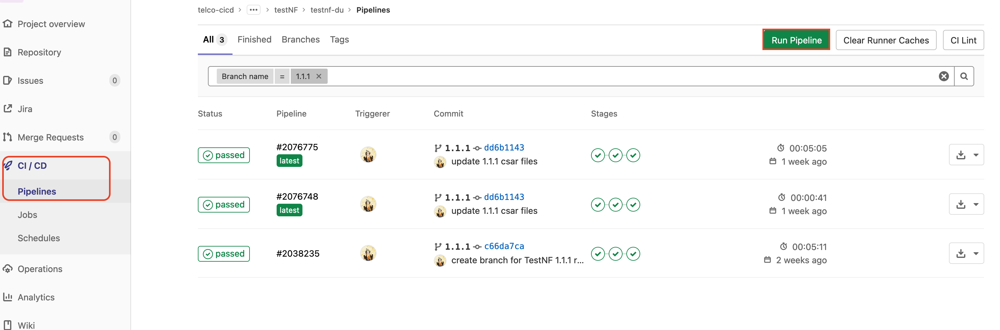

- [Description](#description)
- [Pre-requisites](#pre-requisites)
  - [Gitlab](#gitlab)
  - [Infrastructure](#infrastructure)
    - [Virtual Infrastructure](#virtual-infrastructure)
    - [TCA](#tca-suite-v19)
    - [Harbor](#partner-systems)
    - [CaaS Infrastructure](#caas-infrastructure)
- [Usage](#usage)
  - [Pipeline Configurations](#pipeline-configurations)
  - [How to onboarding against exist cluster](#how-to-onboarding-against-exist-cluster)
  - [How to trigger pipeline](#how-to-trigger-pipeline)
  - [How to view details/logs of a stage](#how-to-view-detailslogs-of-a-stage)

# Pre-requisites

## Gitlab

- Gitlab 12.10 or higher.
- Gitlab Runner is routable to TCA platform.
- Variables required for the pipeline `Gitlab project->Settings->CICD->Variables`:
  - HARBOR_USERNAME
  - HARBOR_PASSWORD
  - TCA_USERNAME (SSO Account, e.g. administrator@vsphere.local)
  - TCA_PASSWORD

  

## Infrastructure

  ### TCA suite (v2.0)
  -  TCA-CP
  -  TCA
  -  TKG template. Use the BYOI TKG template instead of the upstream TKG template.
  ### Virtual Infrastructure
  - vCenter (v7.0+)
  - ESX (v7.0+)
    - SRIOV enabled in both BIOS and vmnic
    - (optional) PTP nic for flexran test
  - VRO
  - (Optional) NSX-T.
  - DVSwitch port groups (notice that NSX-t managed segment is not supported for SRIOV network adapter)
    1. One port group for TestNF vmxnet3 network adapter, use for Kubernetes management network
    2. One port group for TestNF vmxnet3 network adapter, used for ipvlan CNI test
    3. One port group for TestNF vmxnet3 network adapter, used for macvlan CNI test. Promiscuous mode and Forged transmits need to be set to "Accept" instead of "Reject".
    4. One port group for TestNF SRIOV network adapter, used for SRIOV(host device) CNI test
    5. One port group for 2 TestNF SRIOV network adapters, used for DPDK igb_uio binding
    6. One port group for TestNF SRIOV network adapter, used for DPDK vfio-pci binding
  ### Partner Systems
  - Harbor. The TestNF helm chart needs to be uploaded to this harbor.
  ### CaaS Infrastructure
  -  1+ Kubernetes management cluster
  -  1+ Kubernetes workload cluster. For testnf-du, 8CPU/16GB memory are the minimal requirement for the target worker node. For testnf-du-flexran, 8CPU/32GB memory are the minimal requirement.

  ***Note***
  - when creating node pool, please add two extra networks: vlan1, vlan2. vlan1 is used for ipvlan CNI test, vlan2 is used for macvlan CNI test.
  - Both testnf-du and testnf-du-flexran are NUMA awared. Woker node CPU number should not exceed the host NUMA boundary. For example: If the ESX box has 2 CPU sockets, 14 cores per socket and hyperthreading activated, then the worker node CPU number should not exceed 24(=14cores * 2 hyperthreading - 2*2 esx reserved cores), else, you might encounter the failure during node customization(error message: worker node cpus 32 cannot be greater than Numa size 28).
  ### (Optional) IPAM NF
  IPAM CNI could be host-local or whereabouts. For IPAM with whereabouts, please ensure that whereabouts NF was instantiated before TestNF instantiation. You can use whereabouts csar and helm chart to instantiate whereabouts.

# Usage

## Pipeline Configurations

For CNF onboaring each network function requires a csar file, values.yaml and related configuration files. 

Before triggering the CI/CD pipeline, make sure to check following configuration files:

1. **config.yml**: defines paramters used for TestNF onboarding.
   *Note: Make sure to update "\<variables\>" in the file according to your environment.*

    ```yml
    # Provide tca environment information
    tca:
      server: https://<TCA_IP_ADDRESS>
      
    cnf:
      - name: 'testnf-du'
        csar: 'testnf-du-1.2.0.csar'
        node_group: <nodepool_name>
        clusterName: <cluster_name>
        namespace: 'testnf'
        repoUrl: <helm_charts_repo>
        helm_name: 'testnf1'
        onboard:
          metadata:
            values: UPLOAD_FILE("values.yaml")  ##optional
            vlan3: "{{ NETWORK(<portgroup_name>) }}"
            vlan4: "{{ NETWORK(<portgroup_name>) }}"
            vlan5: "{{ NETWORK(<portgroup_name>) }}"
          lcmInterfaces:
            instantiate_start:
              - name: K8S_NAMESPACE
                type: string
                value: testnf
              - name: NAD_FILE
                type: file
                value:
                  - data: UPLOAD_FILE("testnf_nad.yaml")
                    name: "testnf_nad.yaml"
                    isPackaged: false
            instantiate_end:
              - name: K8S_NAMESPACE
                type: string
                value: testnf
        reconfigure: {}
    ```
    Modify these parameters:
    - **tca.server**: This should be your tca server address.
    - **cnf.clusterName**: Which K8S cluster should be used.
    - **cnf.node_group**: Which node pool of the K8S cluster should be used.
    - **cnf.repoUrl**: Where download TestNF helm charts.
    - **metadatal.vlan**: The port group name which will be used.

2. **config-whereabouts.yml**: defines paramters used for whereabouts onboarding.
    ```yml
    # Provide tca environment information
    tca:
      server: https://<TCA_IP_ADDRESS>
 
    # Provide cnf releated information which will be used during CNF instantiating.
    cnf:
      - name: 'whereabouts'
        csar: 'Whereabout.csar'
        node_group: <nodepool_name>
        clusterName: <cluster_name>
        namespace: 'whereabouts'
        repoUrl: <helm_charts_repo>
        helm_name: 'whereabouts'
        onboard:
          metadata: {}
          lcmInterfaces: {}
        reconfigure: {}
    ```
    
    Modify these parameters:
    - **tca.server**: This should be your tca server address.
    - **cnf.clusterName**: Which K8S cluster should be used.
    - **cnf.node_group**: Which node pool of the K8S cluster should be used.
    - **cnf.repoUrl**: Where download TestNF helm charts.
    - **metadatal.vlan**: The port group name which will be used.

## How to trigger pipeline

There are two ways to trigger the pipeline:

1. **Maually using `Run Pipeline` button**:
   Location:  `Gitlab project -> CI/CD -> Pipelines`.
   *Make sure to select correct branch, if different from default branch.*

    

2. **Auto trigger with code commit**
   Rules to auto trigger pipeline based on a file change can be set here: `.gitlab/ci/rules.gitlab-ci.yml`
   Changes in following files will auto trigger the pipeline with code commit:

      - all configuration files except `.gitlab/ci/*` and `.gitlab-ci.yml`

   Changes in other files will not trigger pipeline automatically. 

## How to view details/logs of a stage

Go to project -> CI/CD -> Pipelines, click on the failed/passed stage:


Gitlab will redirect to the details of the stage:

