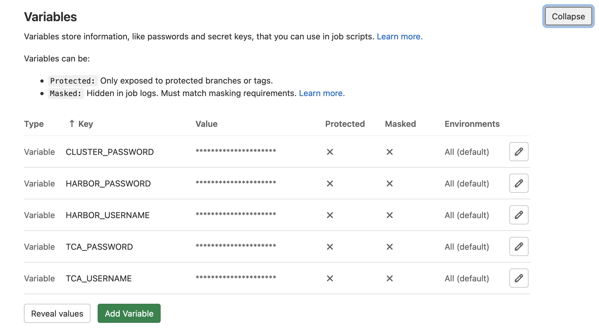
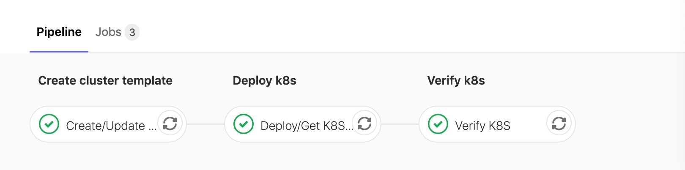
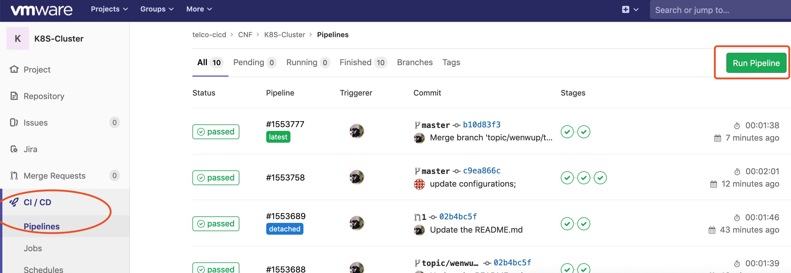
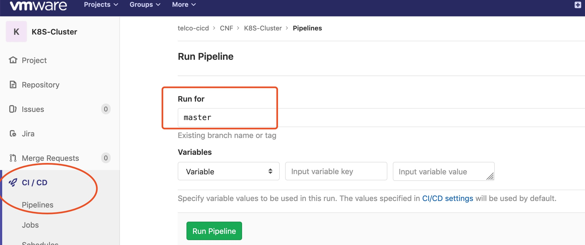
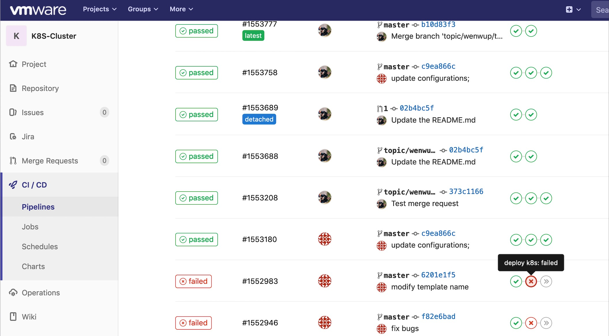
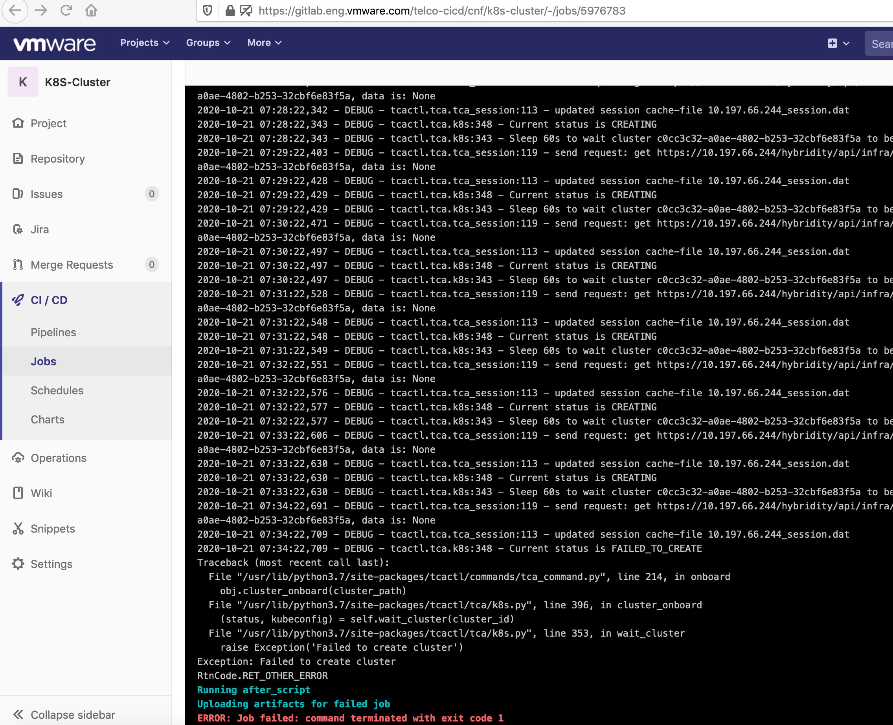

- [Description](#description)
- [Pre-requisites](#pre-requisites)
  - [Gitlab](#gitlab)
  - [Harbor](#harbor)
  - [Telco Cloud Automation (TCA)](#telco-cloud-automation-tca)
- [Usage](#usage)
  - [Configurations](#configurations)
  - [Cluster LCM](#cluster-lcm)
    - [K8S Cluster LCM](#k8s-cluster-lcm)
    - [Nodepool LCM](#nodepool-lcm)
  - [How to trigger pipeline](#how-to-trigger-pipeline)
  - [How to view details/logs of a stage](#how-to-view-detailslogs-of-a-stage)

# Description

Complete pipeline of TKG cluster deployment.

# Pre-requisites

## Gitlab

- Gitlab 12.5 or higher.
- Gitlab Runner is routable to TCA platform.
- Variables required for the pipeline `Gitlab project->Settings->CICD->Variables`:
  - HARBOR_USERNAME
  - HARBOR_PASSWORD
  - TCA_USERNAME (SSO Account, e.g. administrator@vsphere.local)
  - TCA_PASSWORD
  - CLUSTER_PASSWORD (this will be set automatically by the pipeline.)

  

## Harbor

Harbor is an open source registry that secures artifacts with policies and role-based access control, ensures images are scanned and free from vulnerabilities, and signs images as trusted.
It is used to provide vendor's image and helm charts for Gitlab pipeline. `Https harbor is recommended for the pipeline.`

## Telco Cloud Automation (TCA)

TCA has two types of appliances:

- **TCA Manager**: It provides overall orchestration and life cycle management components for infrastructure, network functions and services.
- **TCA-CP**: It serves as control plane closer to the infrastructure/VIM.

# Usage

## Configurations

Pipeline has three sections:

1. **Cluster automation:** To create workload cluster for onboard CNFs using cluster template. It also includes cluster testing before onboarding.

  Example of overall pipeline:
    

2. cluster-templates/$site/cluster-template.yaml
    This template file can be used as is or can be modified as per the environment.
```yaml
    clusterType: WORKLOAD
    name: ndc-management
    description: Cluster template for CI/CD
    clusterConfig: #Optional. If not provided, will add the following default values.
      csi:
        - name: nfs_client
        - name: 'vsphere-csi'
          properties:
            timeout: "250"
      cni:
        - name: calico
        - name: multus
      kubernetesVersion: v1.19.1+vmware.2
      tools:
        - name: helm
          version: 3.3.1
    masterNodes:
      - cpu: 8
        labels:
          - master=true
        replica: 1
        memory: 16384
        name: mgmt-master
        networks:
          - label: MANAGEMENT
        storage: 50
        taint: true
    workerNodes:
      - cpu: 4
        labels:
          - worker=true
        replica: 1
        memory: 2048
        name: mgmt-worker
        networks:
          - label: MANAGEMENT
        storage: 20
        config:
          cpuManagerPolicy:
            type: kubernetes
            policy: default         # The policy should be set static in RAN network.
```
> Labels of nodes and networks in this template file are reused in "cluster.yml" file.

3. clusters/$site/cluster.yaml
    defines variables of spec to create workload cluster.
    We recommend you to put these cluster specs into clusters project.

    *Note*
    * Make sure to update the "\<variables\>" according to the environment.
    * The name value in workersNodes or masterNodes should be the same as node pool name in cluster template spec.

```yaml
    name: <cluster_name>
    clusterType: WORKLOAD
    clusterTemplateName: <cluster_template_name>
    description: workload cluster for CI/CD
    # This should be the virtual infrastructure name you want to use.
    vim_name: <vim_name> 
    vmTemplate: photon-3-kube-v1.19.11+vmware.2
    managementClusterName: <management_cluster_name>

    # These parameters are placement parameters. They are optional. Here are default values.
    network: management
    resourcePool: rp-tkg
    datastore: <vim_name>-ds-vsan01
    folder: <folder>
    clusterComputeResource: <vim_name>-cl01
   
    masterNodes:
      - name: mgmt-master
        networks:
          - label: MANAGEMENT
        networkName: <portgroug-name>
    workerNodes:
      - name: mgmt-worker
        networks:
        - label: MANAGEMENT
          networkName: <portgroug-name>
          nameservers:
            - <dns-server>
        # This part is optional. If you want to deploy nodes on other place, you can provide these parameters.
        placementParams:
          - name: tcp-regional02-esx02.tcplab.io
            type: ComputeResource
          - name: tcp-regional02-esx02-localDS-3
            type: Datastore
          - name: /central01-dc01/host/cell01/tcp-regional02-esx02.tcplab.io/Resources
            type: ResourcePool
  
    clusterConfig:
      csi:
        - name: nfs_client
          properties:
            serverIP: <nfs_server>
            mountPath: <nfs_mount_folder>
```
4. config.yml: defines parameters used for .
Pipeline will create cluster templates and clusters in order.
Note: Make sure to update "<variables>" in the file according to your environment.
```yaml
    # TCA information
    tca:
      server: https://<tca_server_ip>
   
    cluster-template:
      - <cluster_template_file_path>
      - ...
   
    cluster:
      - <cluster_file_path>
      - ...
```

## Cluster LCM
Pipeline also support K8S cluster LCM, including create, update, and delete operations.
It will compare the cluster.yml provided and the one existing in TCA, to decide which operation should be done automatically.
### K8S Cluster LCM
| Operation | Description | 
| ---      |  ------  |
| CREATE   | Check whether cluster name exists in TCA. If not, it will create a new one.   | 
| UPDATE | Only support to change **replica number** and **labels**. Other changes will be ignored. | 
| DELETE | Please add **delete: true** if want to delete the cluster |

For example

- If the cluster spec likes this, pipeline will delete this cluster from TCA.
```yaml
    name: <cluster_name>
    clusterType: WORKLOAD
    delete: true
    clusterTemplateName: <cluster_template_name>
    description: workload cluster for CI/CD
    vim_name: <vim_name>
    vmTemplate: photon-3-kube-v1.19.11+vmware.2
    ...
```

- Suppose the content of cluster.yml like this. In this spec, it increases replica number of master nodes, and modifies the timeout value in clusterConfigurations part. 
Then pipeline backend will catch these changes, and update them in TCA.
```yaml
    name: <cluster_name>
    clusterType: WORKLOAD
    clusterTemplateName: <cluster_template_name>
    description: workload cluster for CI/CD
    vim_name: <vim_name>
    vmTemplate: photon-3-kube-v1.19.11+vmware.2
    managementClusterName: <management_cluster_name>
   
    masterNodes:
      - name: nrf-mc01
        replica: 3 #Suppose it was 1  
        networks:
          - label: k8s-mgmt
        networkName: management
    workerNodes:
      - name: nrf-wl01
        networks:
        - label: k8s-mgmt
        networkName: management
    clusterConfig:
      csi:
        - name: nfs_client
          properties:
            serverIP: <nfs_server>
            mountPath: <nfs_mount_folder>
        - name: 'vsphere-csi'
          properties:
            timeout: "300" #Suppose it was "250"
```

### Nodepool LCM
| Operation | Description | 
| ---      |  ------  |
| CREATE   | Check whether nodepool name exists in TCA. If not, it will create a new one.   | 
| UPDATE | Only support to change **replica number** and **labels**. Other changes will be ignored. | 
| DELETE | Just remove the nodepool from workernodes section. Pipeline backend will get the list which exist in TCA but not in provided spec, and delete them. |

For example,

- Suppose here is the new content of cluster.yml. In this spec, it increases replica number of existing nodepool `nrf-wl01`, and adds a new nodepool `new-nodepool`.
Then CI/CD backend will catch these changes, update the existing one and create a new one.
```yaml
    name: <cluster_name>
    clusterType: WORKLOAD
    ...
   
    masterNodes:
      - ...
    workerNodes:
      - name: nrf-wl01
        replica: 3 #Suppose it was 1
        labels:   #Changed
          - new=label
          - test=true
        networks:
          - label: k8s-mgmt
            networkName: management
      - name: new-nodepool #Which doesn't exist in TCA
        cpu: 8
        labels:
          - test1=true
          - test=true
        replica: 2
        memory: 16384
        networks:
          - label: MANAGEMENT
            networkName: k8s-mgmt
        storage: 100
        config:
          cpuManagerPolicy:
            type: kubernetes
            policy: default
    clusterConfig:
      ...
```
## How to trigger pipeline

There are two ways to trigger the pipeline:

1. **Maually using `Run Pipeline` button**:
   Location:  `Gitlab project -> CI/CD -> Pipelines`.
   *Make sure to select correct branch, if different from default branch.*

    
    

2. **Auto trigger with code commit**
   Changes in following files will auto trigger the pipeline with code commit:

      - `.gitlab-ci.yml`
      - `config.yml`

   Changes in other files will not trigger pipeline automatically. Rules to auto trigger pipeline based on a file change can be set here: `.gitlab/ci/rules.gitlab-ci.yml`

## How to view details/logs of a stage

Go to project -> CI/CD -> Pipelines, click on the failed/passed stage:


Gitlab will redirect to the details of the stage:

