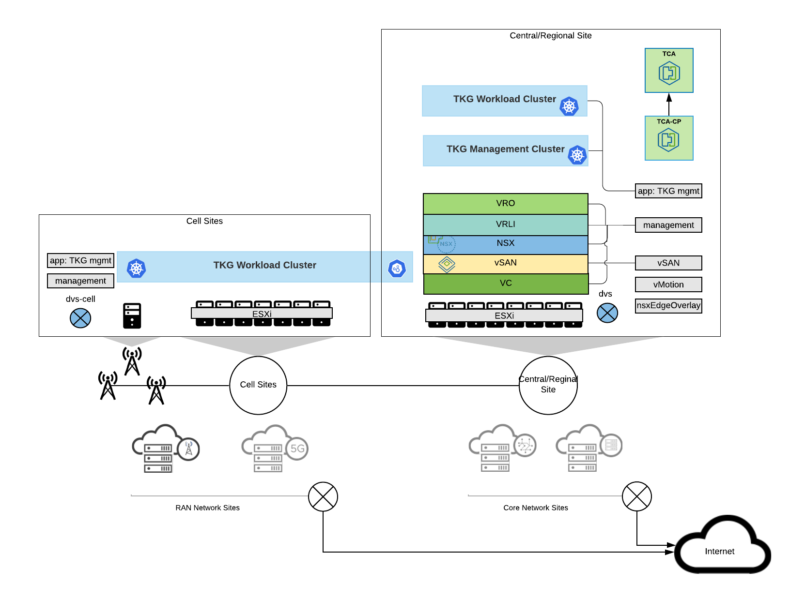
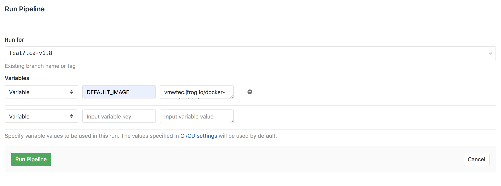
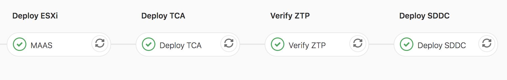

- [Overview](#overview)
- [Pre-requisites](#pre-requisites)
  - [Gitlab](#gitlab)
    - [Gitlab Variables](#gitlab-variables)
  - [MaaS(Optional)](#maasoptional)
    - [MAAS Images](#maas-images)
  - [Vault(Optional)](#vaultoptional)
  - [DNS Records](#dns-records)
  - [Licenses](#licenses)
  - [Hardware](#hardware)
- [Description](#description)
  - [Toplogy](#toplogy)
  - [Structure](#structure)
  - [Configurations](#configurations)
    - [Global Configuration](#global-configuration)
    - [ZTP Configuration](#ztp-configuration)
    - [MAAS Configuration](#maas-configuration)
  - [Usage](#usage)
  - [Note](#note)

# Overview
This Project is used to bring up the whole SDDC setup, which includes TCA, TCA-CP, vCenter, vSAN, NSX, vRealize LogInsight, vRealize Orchestrator and others. 

# Pre-requisites

## Gitlab

*  Gitlab version should be at least 12.5 or higher.

*  Gitlab Runner should be already configured and running well. If not, please add one for this group. And it should connect with these service:
   - file server which provide TCA and other VMware stack ova files.
   - maas server (optional)
   - the ESXi host which TCA will host
   - management network 

### Gitlab Variables
Please add these environment variables in Gitlab->CI/CD->Variables before running pipeline.
| Variable | Description |
| --- | --- |
| ESX_PASSWD | The ESXi password  |
| TCA_ADMIN_PWD | TCA admin user's password  |
| TCA_ROOT_PWD | TCA root user's password |

If you use MAAS, you need to add another 2 variables.
| Variable | Description |
| --- | --- |
| MAAS_APIKEY | MAAS APIKEY  |
| ILO_PASSWORD | ILO password  |

## MaaS(Optional)
MaaS could be used to re-image ESXi on bare metal machines. You can also install ESXi on other ways.

Deploy Ubuntu18.04 within the native vlan used by ESXi management work.

Install MAAS version 2.7
```shell script
sudo snap install maas --channel=2.7
```
During the installation process, provide url, username and password, and set mode to be all.

Create subnet and ip ranges for your environment
- Open URL on your browser, and click Subnets→ VLAN
- Enable DHCP if needed
- Add reserved IP ranges(optional) if you want to reserve ip ranges for other usage.
- Add reserved dynamic IP ranges(optional) if you want to specify ip ranges for pxe boot usage.
- Refer this page https://maas.io/docs/dhcp for other situation.

Add DNS and NTP server in Settings->Network on MAAS UI if you want to use your own DNS or NTP server.

**Note**
1. Ensure the NIC whose MAC address provided in maas.yml has PXE boot enabled.
2. The NIC that set PXE boot should be at first in boot sequence.
3. Assume subnets have been created on MAAS.
4. Subnets should be native vlan on the MAC.

For more details, see MaaS document https://maas.io/docs.

### MAAS Images
The MAAS images are used to deploy ESXi by MAAS. You can download them here.
- ESXi 7.0(15843807): https://vmwtec.jfrog.io/artifactory/generic-cicd-production/maas/vmware-esxi-70.dd.gz
- ESXi 7.0u1(16850804): https://vmwtec.jfrog.io/artifactory/generic-cicd-production/maas/vmware-esxi-70u1.dd.gz 

## DNS Records
All the dns mappings for appliances should be created on the DNS server before running this pipeline, otherwise ZTP process will fail.

The FQDN for each appliance will be given as **{appliance.name}-{domain.name}.{dnsSuffix}**. For example, if dns suffix is .dp.vmw, and domain name is xr11, and appliance names are vcenter, vrealize... Then DNS records should be

| FQDN | Description |
| --- | --- |
| vcenter-xr11.dp.vmw  | Vcenter  |
| sddcmanager-xr11.dp.vmw  | SDDC manager| 
| nsxmgr-xr11.dp.vmw  | NSX manager FQDN  |
| nsx001-xr11.dp.vmw  | NSX manager node 1  |
| nsx002-xr11.dp.vmw  | NSX manager node 2  |
| nsx003-xr11.dp.vmw  | NSX manager node 3 |
| nsx-edge001-xr11.dp.vmw  | NSX edge node 1 |
| nsx-edge001-xr11.dp.vmw  | NSX edge node 2 |
| tca-xr11.dp.vmw  | TCA |
| tca-cp-xr11.dp.vmw  | TCA-CP  |
| cloudbuilder-xr11.dp.vmw  | MAAS APIKEY  |
| vrli-xr11.dp.vmw  | vRealize log insight |
| xr11-fs01.dp.vmw  | Optional. Only used when vSAN NFS service is enabled. File sevice node 1  |
| xr11-fs02.dp.vmw  | Optional. Only used when vSAN NFS service is enabled. File sevice node 2  |
| xr11-fs03.dp.vmw  | Optional. Only used when vSAN NFS service is enabled. File sevice node 3  |


## Licenses
You should get licenses for this following vmware products and put it into ztp configurations(tcf.yml).

| Product | Number |
| --- | --- |
| VC | One for each central/regional site  |
| ESXi | One for each central/regional site  |
| vSAN | One for each central/regional site  |
| NSX | One for each central/regional site  |
| TCA | Only one set in central site  |
| TCA-CP | One for each central/regional site  |
| VRLI | One for each central/regional site  |

## Hardware
- All disk partitions except the boot disk of the ESXi hosts should be cleaned.
- If ESXi hosts don't have a portgroup named as `VM Network`, please create one for each host.
- If management network does not use native vlan, please set the VLAN id for VM Network and management network portgroup.
- If you modify ESXi host name after it’s re-imaged, please run these commands on the host
		- /sbin/generate-certificates 
		- /etc/init.d/hostd restart
- As all the resources will occupy 160GB memory size and Kubernetes cluster will be deployed later, please make sure your hosts can provide enough resources.
- Enable SR-IOV for each host on VC GUI after provisioning process is done. If you want to use SR-IOV.
- The management network for TCA and Kubernetes clusters, should have access to the Internet.


# Description

## Toplogy
Here is just an example topoloy, and it only has one central site and one cell site. You can create several sites, and even have a regional site if you have more hosts.


## Structure
- `your_setup/` includes spec and manifests of vendors and environments, such as machines, networks and so on. 
    - `global.yml` provides vault and others information.
    - `tcf.yml` provides network, images, licenses and others information of the environment.
    - `maas.yml` provides baremetal machines and maas information.
- `.gitlab-ci.yml` the entrypoint of the pipeline
- `.gitlab/ci` includes pipeline files.
    
## Configurations
### Global Configuration
```yaml
# global.yml
vault:  # This section provides vault related information. Disabled by default.
  addr: http://10.197.66.248:8200
  enabled: false
  role: hardware-deployment

TCA:   # This section provides TCA and its setup information.
  ip: 10.197.66.62  # This ip address of TCA
  hostname: tca-central01.tcplab.io  # TCA FQDN
  setup:  # Pipeline will setup TCA according to this information.
    gateway: 10.197.66.253
    prefix_length: 24
    ntp: 10.197.66.65
    dns: 10.197.66.65
    search_domain: tcplab.io
    ova: http://buildweb.eng.vmware.com/ob/api/17361176/deliverable/?file=publish/VMware-Telco-Cloud-Automation-1.8.0-17361176.ova
    target: tcp-central01-esx01.tcplab.io  # The host which TCA will be deployed on.
    datastore: datastore1 # The host which TCA will use.
    network: VM Network # The network name which TCA will use.
```

### ZTP Configuration
Here is just a template.
> All the passwords here should be base64 encoded. All the passwords list here are `Passsw0rd12345!`
```yaml
# tcf.yml
_comment: // All passwords must be of length 13 characters or more
domains:
- name: central01
  type: CENTRAL_SITE    // You must have a CENTRAL_SITE.
  enabled: true
  minimumHosts: 4
  location:
    city: Palo Alto
    country: United States of America
  services:
  - name: networking
    type: nsx
    enabled: false
    nsxConfig:
      shareOverlayTransportZoneWithParent: false
  - name: storage
    type: vsan
    enabled: false
  licenses:
    vc:
    - XXXX-XXXX-XXXX-XXXX-XXXX
    esxi:
    - XXXX-XXXX-XXXX-XXXX-XXXX
    nsx:
    - XXXX-XXXX-XXXX-XXXX-XXXX
    vsan:
    - XXXX-XXXX-XXXX-XXXX-XXXX
    tca:
    - XXXXXXXXXX
    tca_cp:
    - XXXXXXXXXX
    vrli:
    - XXXX-XXXX-XXXX-XXXX-XXXX
  switches:
  - name: dvs-central
    uplinks:
    - pnic: vmnic0
    - pnic: vmnic1
  networks:
  - switch: dvs-central
    name: management
    type: management
    mtu: 1500
    vlan: 0
    network: 10.x.x.0
    prefixLength: 24
    gateway: 10.x.x.x
    _comments:
    - This network requires DHCP configured on the network
  - switch: dvs-central
    name: vMotion
    type: vMotion
    mtu: 9000
    vlan: 3125
    network: 172.25.10.0
    prefixLength: 24
    gateway: 172.25.10.1
    ipPool:
    - start: 172.25.10.100
      end: 172.25.10.120
  - switch: dvs-central
    name: vSAN
    type: vSAN
    mtu: 9000
    vlan: 3126
    network: 172.26.10.0
    prefixLength: 24
    gateway: 172.26.10.1
    ipPool:
    - start: 172.26.10.100
      end: 172.26.10.120
  - switch: dvs-central
    name: nsxHostOverlay
    type: nsxHostOverlay
    mtu: 9000
    vlan: 3127
    network: 172.27.10.0
    prefixLength: 24
    gateway: 172.27.10.1
    _comments:
    - This network requires DHCP configured on the network
  - switch: dvs-central
    name: nsxEdgeOverlay
    type: nsxEdgeOverlay
    mtu: 9000
    vlan: 3128
    network: 172.28.10.0
    prefixLength: 24
    gateway: 172.28.10.1
  - switch: dvs-central
    name: uplink1
    type: uplink
    mtu: 9000
    vlan: 3083
    ipAddresses:
    - 172.16.2.10
    - 172.16.2.11
    prefixLength: 24
    gateway: 172.16.2.1
  - switch: dvs-central
    name: uplink2
    type: uplink
    mtu: 9000
    vlan: 3084
    ipAddresses:
    - 172.18.32.10
    - 172.18.32.11
    prefixLength: 24
    gateway: 172.18.32.1
  - type: application
    name: vlan3084
    segmentType: vlan
    switch: dvs-central
    vlan: 3084
    mtu: 1500
  applianceOverrides:
  - type: VC
    name: vc
    ipIndex: 71
    rootPassword: UGFzc3cwcmQxMjM0NSE=
    adminPassword: UGFzc3cwcmQxMjM0NSE=
  - type: SDDC_MANAGER
    name: sddc-manager
    ipIndex: 72
    rootPassword: UGFzc3cwcmQxMjM0NSE=
    adminPassword: UGFzc3cwcmQxMjM0NSE=
    vcfPassword: UGFzc3cwcmQxMjM0NSE=
  - type: CLOUD_BUILDER
    name: cloud-builder
    ipIndex: 73
    rootPassword: UGFzc3cwcmQxMjM0NSE=
    adminPassword: UGFzc3cwcmQxMjM0NSE=
    vcfPassword: UGFzc3cwcmQxMjM0NSE=
  - type: VRO
    name: vro
    ipIndex: 74
    rootPassword: UGFzc3cwcmQxMjM0NSE=
    adminPassword: UGFzc3cwcmQxMjM0NSE=
  - type: NSX_MANAGER
    name: nsx
    ipIndex: 75
    rootPassword: UGFzc3cwcmQxMjM0NSE=
    adminPassword: UGFzc3cwcmQxMjM0NSE=
    auditPassword: UGFzc3cwcmQxMjM0NSE=
  - type: NSX_MANAGER_NODE
    name: nsx01
    ipIndex: 76
    parent: nsx
  - type: NSX_MANAGER_NODE
    name: nsx02
    ipIndex: 77
    parent: nsx
  - type: NSX_MANAGER_NODE
    name: nsx03
    ipIndex: 78
    parent: nsx
  - type: NSX_EDGE_CLUSTER
    name: edgeCluster01
    size: large
    tier0Mode: ACTIVE_STANDBY
    rootPassword: UGFzc3cwcmQxMjM0NSE=
    adminPassword: UGFzc3cwcmQxMjM0NSE=
    auditPassword: UGFzc3cwcmQxMjM0NSE=
  - type: NSX_EDGE
    name: nsx-edge01
    parent: edgeCluster01
    ipIndex: 79
  - type: NSX_EDGE
    name: nsx-edge02
    parent: edgeCluster01
    ipIndex: 80
  - type: TCA_CP
    name: tca-cp
    ipIndex: 81
    rootPassword: UGFzc3cwcmQxMjM0NSE=
    adminPassword: UGFzc3cwcmQxMjM0NSE=
  - type: VRLI
    name: vrli
    ipIndex: 82
  - _comment: []
    type: VSAN_NFS
    name: fs
    nodeCount: 4
    ipIndexPool:
    - start: 83
      end: 86
    shares:
    - name: second-share
      quotaInMb: '10240'
  - name: edgeCluster01
    type: NSX_EDGE_CLUSTER
    nameOverride: edgeCluster-cicd
    size: large
    tier0Mode: ACTIVE_STANDBY
    rootPassword: UGFzc3cwcmQxMjM0NSE=
    adminPassword: UGFzc3cwcmQxMjM0NSE=
    auditPassword: UGFzc3cwcmQxMjM0NSE=
- name: cell01
  type: CELL_SITE_GROUP
  enabled: true
  parent: central01
  switches:
  - name: dvs-cell
    uplinks:
      - pnic: vmnic0
      - pnic: vmnic1
  networks:
    - type: management
      name: management
      segmentType: vlan
      switch: dvs-cell
      vlan: 0
      mtu: 1500
settings:
  dnsSuffix: tcplab.io
  saas: 10.197.66.8
  ntpServers:
  - 10.197.66.65
  dnsServers:
  - 10.197.66.65
appliances:
- type: VC
  name: vc
  ipIndex: 31
  rootPassword: UGFzc3cwcmQxMjM0NSE=
  adminPassword: UGFzc3cwcmQxMjM0NSE=
- type: SDDC_MANAGER
  name: sddc-manager
  ipIndex: 32
  rootPassword: UGFzc3cwcmQxMjM0NSE=
  adminPassword: UGFzc3cwcmQxMjM0NSE=
  vcfPassword: UGFzc3cwcmQxMjM0NSE=
- type: CLOUD_BUILDER
  name: cloud-builder
  ipIndex: 33
  rootPassword: UGFzc3cwcmQxMjM0NSE=
  adminPassword: UGFzc3cwcmQxMjM0NSE=
  vcfPassword: UGFzc3cwcmQxMjM0NSE=
- type: VRO
  name: vro
  ipIndex: 34
  rootPassword: UGFzc3cwcmQxMjM0NSE=
  adminPassword: UGFzc3cwcmQxMjM0NSE=
- type: NSX_MANAGER
  name: nsx
  ipIndex: 35
  rootPassword: UGFzc3cwcmQxMjM0NSE=
  adminPassword: UGFzc3cwcmQxMjM0NSE=
  auditPassword: UGFzc3cwcmQxMjM0NSE=
- type: NSX_MANAGER_NODE
  name: nsx01
  ipIndex: 36
  parent: nsx
- type: NSX_MANAGER_NODE
  name: nsx02
  ipIndex: 37
  parent: nsx
- type: NSX_MANAGER_NODE
  name: nsx03
  ipIndex: 38
  parent: nsx
- type: NSX_EDGE_CLUSTER
  name: edgeCluster01
  size: large
  tier0Mode: ACTIVE_STANDBY
  rootPassword: UGFzc3cwcmQxMjM0NSE=
  adminPassword: UGFzc3cwcmQxMjM0NSE=
  auditPassword: UGFzc3cwcmQxMjM0NSE=
- type: NSX_EDGE
  name: nsx-edge01
  parent: edgeCluster01
  ipIndex: 39
- type: NSX_EDGE
  name: nsx-edge02
  parent: edgeCluster01
  ipIndex: 40
- type: TCA_CP
  name: tca-cp
  ipIndex: 60
  rootPassword: UGFzc3cwcmQxMjM0NSE=
  adminPassword: UGFzc3cwcmQxMjM0NSE=
- type: VRLI
  name: vrli
  ipIndex: 61
  rootPassword: UGFzc3cwcmQxMjM0NSE=
  adminPassword: UGFzc3cwcmQxMjM0NSE=
- _comment: []
  type: VSAN_NFS
  name: fs
  nodeCount: 3
  ipIndexPool:
  - start: 63
    end: 64
  - start: 68
    end: 69
  shares:
  - name: second-share
    quotaInMb: '10240'
images:
  cloudbuilder: <ova-download-url>
  vro: <ova-download-url>
  tca: <ova-download-url>
  kube:
  - <ova-download-url>
  vrli: <ova-download-url>
```

### MAAS Configuration
> Even if you want to skip MAAS stage, you must provide the hostname information in `maas.yml` because pipeline will get which hosts should be registered to which domain from this file.

> The `ztp_domain` name in each site should be the same with `domain name` in `tcf.yml`.

Here is just a template. For CENTRAL_SITE and REGIONAL_STIE, it should have at least 3 hosts.
```yaml
server: http://10.197.66.65:5240/MAAS/    # MAAS address
username: admin                           # MAAS username
image:                                    # Which image should be used
  name: 7.0u1
  url: http://10.196.228.199:8080/demo/vmware-esxi-70u1.dd.gz

datacenters:
  CENTRAL_SITE:
    - domain: tcplab.io
      ztp_domain: central01               # This is the domain name in tcf.yaml
      hosts:                              # Provide host information. If don't use MaaS, just set hostname.
        - architecture: amd64
          hostname: tcp-central01-esx01 
          power_type: ipmi
          mac_addresses:
            - e4:43:4b:39:98:b8
          power_parameters:
            power_address: 10.197.140.65
            power_user: root
  CELL_SITE_GROUP:
    - domain: tcplab.io
      ztp_domain: cell01 # This is the domain name in tcf.yaml
      hosts:
        - architecture: amd64
          hostname: tcp-cell01-esx01
          power_type: ipmi
          mac_addresses:
            - e4:43:4b:2a:8f:50
          power_parameters:
            power_address: 10.197.140.75
            power_user: root
```

## Usage
- Edit configuration files of hardware-configs projects to align with your environment.
- Go to CI/CD -> Pipelines and click Run Pipeline. You can use this image(vmwtec.jfrog.io/docker-dev-cicd/cicd-toolsbox:tca-v1.8_1787786) now.

- Pipeline workflows will like this following image.


## Note
  * If you want to skip MAAS stage, and deploy ESXi by yourselves, just set `SKIP_MAAS` value to be `no` in `.gitlab-ci.yml`.
  * Even if you want to skip MAAS stage, you must provide the hosts information in `maas.yml` because pipeline will get which hosts should be registered to which domain from this file.
  * Cloudbuilder version which is set in `tcf.yaml` has limitations on ESXi version. You can refer its release notes(https://docs.vmware.com/en/VMware-Cloud-Foundation/4.1/rn/VMware-Cloud-Foundation-41-Release-Notes.html#swversions).
