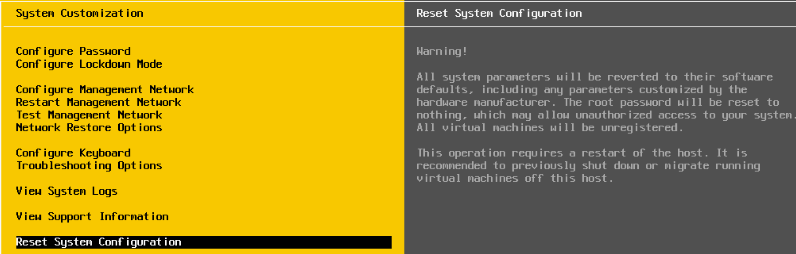

# Description

Project to wipe and free all ESXi servers from SDDC deployment by reset system configuration


# Prerequisite

1. DHCP enabled on the management network of ESXi server to keep the server IP consistent with the one before host reset
2. Gitlab runner can pull image from vmwtec.jfrog.io

# Usage

## Option 1: Run with pipeline under project reset-hosts (telco-cicd/krypton/reset-hosts)
1. Specific the hosts file with target hosts
2. Trigger pipeline with your hosts file

## Option2: Run inside the container boot from toolsbox image
1. Set ENV Var ESX_PASSWD as: **export ESX_PASSWD=your-esxi-password**
2. Prepare hosts file (e.g. **hosts_file** ) with your target hosts FQDN/IP per line as:
```
<fqdn-host1 or ip-host1>
<fqdn-host2 or ip-host2>
```
3. Reset hosts: **tcpctl reset-host --hosts-file <hosts_file>**
```
root [ ~ ]# tcpctl reset-host --help
Usage: tcpctl reset-host [OPTIONS]

Options:
  -v, --verbose         Show more details
  --hosts-file TEXT     File to provide operated hosts
  --host TEXT           Hostname. Can set multiple times.
  -p, --password TEXT   SSH password for hosts, if not set will use Env
                        variable ESX_PASSWD
  --root-password TEXT  Set root password for hosts after reset, if not set
                        will use Env variable ESX_PASSWD
  --help                Show this message and exit.

```
```
It will:
a) Reset host system configuration to factory defaults
b) Enable SSH on host and set root password with the one you supplied after host reset
```
4. Init configuration after reset: **tcpctl post-install --hosts-file <hosts_file> --erase-disk**
```
root [ ~ ]# tcpctl post-install --help
Usage: tcpctl post-install [OPTIONS]

Options:
  -v, --verbose        Show more details
  --hosts-file TEXT    File to provide operated hosts
  --host TEXT          Hostname. Can set multiple times.
  --max-vnfs TEXT      Provide vnf number of the nics
  -p, --password TEXT  SSH password for hosts, if not set will use Env
                       variable ESX_PASSWD
  --erase-disk         Remove datastores and erase disk partitions
  --help               Show this message and exit.
```

```
It will:
a) Enable SSH on hosts if disabled
b) Disable vSAN on hosts
c) Remove exist datastores and erase disk partitions ( All the VMs' remaining data be cleaned )
d) Re-generate cert with FQDN on host which required by VCF
e) Create / Update "VM network" portgroup under vSS with the same vLAN ID as the managment network
f) Enable SRIOV on host and reboot host
```

  **Tip:You can also use this post-install to auto initialize the configuration on servers for SDDC provision**

5. Hosts ready for next SDDC provision (Manual create one local datastore on your selected host for new TCA VM)
