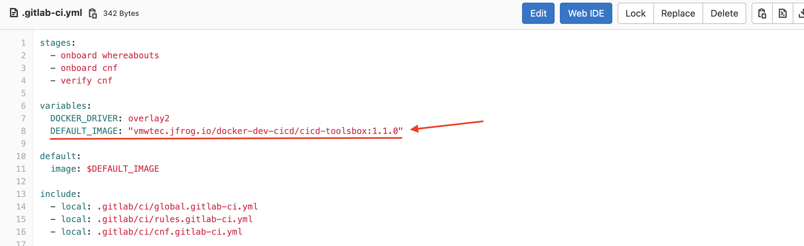

## Latest Release: 1.1.1
- Telco CI/CD 1.1.1 | 24 Jun 2021
- Telco CI/CD 1.1.0 | 28 May 2021

## What's in the Release Notes
The release notes cover the following topics:
- [What's in the Release Notes](#whats-in-the-release-notes)
- [About Telco CI/CD](#about-telco-cicd)
- [New Features](#new-features)
- [Deliverables](#deliverables)
  - [1.1.1](#111)
    - [Enhancement&BugFix](#enhancementbugfix)
  - [1.1.0](#110)
  - [How to use new image](#how-to-use-new-image)
- [Supported TCA Versions](#supported-tca-versions)

## About Telco CI/CD
Telco CI/CD provides a noninteractive system to orchestrate 5G environment setup including underlying SDDC, Kubernetes and CNF via TCA.

## New Features ##
- Support TCA 1.9. TCA 1.9 release notes can be found [here](https://docs.vmware.com/en/VMware-Telco-Cloud-Automation/1.9/rn/VMware-Telco-Cloud-Automation-19-Release-Notes.html)
- Support Kubernetes cluster's day 2 operations: Create/delete/update Kubernetes cluster and nodepool.
- Support TestNF onboarding
- Support SDDC day 2 operation of adding hosts
- Backward compatibility of TCA 1.8
- Refined documentation with architecture diagrams

## Deliverables ##

### 1.1.1
- CICD Image: vmwtec.jfrog.io/docker-dev-cicd/cicd-toolsbox:1.1.1
#### Enhancement&BugFix
- Support helm charts in CSAR when onboarding CNFs.
- Users can customize prefix length when deploying TCA appliance.
- Always generate kubeconfig file when deploying Kubernetes cluster.

### 1.1.0
- CICD Image: vmwtec.jfrog.io/docker-production-cicd/cicd-toolsbox:1.1.0

### How to use new image
For each project, there is a file name as `.gitlab-ci.yml`. You can specific DEFAULT_IMAGE value with your target tag, e.g 1.1.0

## Supported TCA Versions ##
- TCA 1.9
- TCA 1.8
