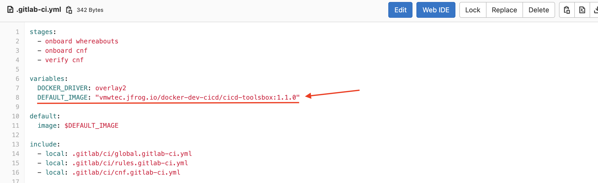

- Telco CI/CD 2.0.0 | 6 Jan 2022

## What's in the Release Notes
The release notes cover the following topics:
- [What's in the Release Notes](#whats-in-the-release-notes)
- [About Telco CI/CD](#about-telco-cicd)
- [New Features](#new-features)
- [Deliverables](#deliverables)
- [Supported TCA Versions](#supported-tca-versions)

## About Telco CI/CD
Telco CI/CD provides a noninteractive system to orchestrate 5G Core and RAN environment setup including underlying SDDC, Kubernetes and CNF with TCA.
It implements Infrastructure as code (IaC) by keeping TCA objects in git repositories, triggering changes by code commits and making changes by pipelines.
CI/CD also implements two command line tools (tcactl & tcpctl) to interact with TCA for all SDDC, Kubernetes and CNF operations.

## New Features ##
- Support TCA 2.0. TCA 2.0 release notes can be found [here](https://docs.vmware.com/en/VMware-Telco-Cloud-Automation/2.0/rn/vmware-telco-cloud-automation-20-release-notes/index.html)
- A standalone tcactl command line tool binary which can run on Linux and Mac. [User Guide](https://confluence.eng.vmware.com/display/TELCOPS/TCACTL+Cookbook)
- New functions
    - Multi VC cluster LCM (attach/sync/detach) in concurrency from TCA
    - Nodepool LCM (attach/sync/detach) in concurrency on stretch cluster from TCA
    - Support multi-harbors for Kubernetes cluster
    - VM based TCA & TCA-CP health diagnose
    - TCA & TCA-CP upgrade in concurrency (generate backup & vm snapshot)
    - Caas cluster upgrade in concurrency (pre/post-validations)
    - Add support for CNF upgrade and delete.
    - Add more sub-commands for tcactl, i.e., `tcactl caas cluster get <name>`
    - User can separate cloud spec into multiple files now. (IaaS)
    - Support get cluster info and kubeconfig for caas cluster on TCA
    - Support Compress csar files
- Backward compatibility of TCA 1.9.5

## Improvements ##
- Adopt API changes in TCA python SDK
- Enhance error handling and log output. More logs in /var/log/cicd directory.
- Generate dynamic child pipelines in CNF pipeline. Users are free from maintaining Gitlab pipelines now.

## Deliverables ##
### 2.0.0
- CICD Image: vmwtec.jfrog.io/docker-production-cicd/cicd-toolsbox:2.0.0
- tcactl cli binary: 
Mac: [tcactl-mac](https://vmwtec.jfrog.io/artifactory/generic-cicd-production/binary/2.0.0/tcactl-mac),
Linux: [tcactl](https://vmwtec.jfrog.io/artifactory/generic-cicd-production/binary/2.0.0/tcactl)

### How to use new image
For each project, there is a file name as `.gitlab-ci.yml`. You can specific DEFAULT_IMAGE value with your target tag, e.g 2.0.0

## Supported TCA Versions ##
- TCA 2.0
- TCA 1.9.5
